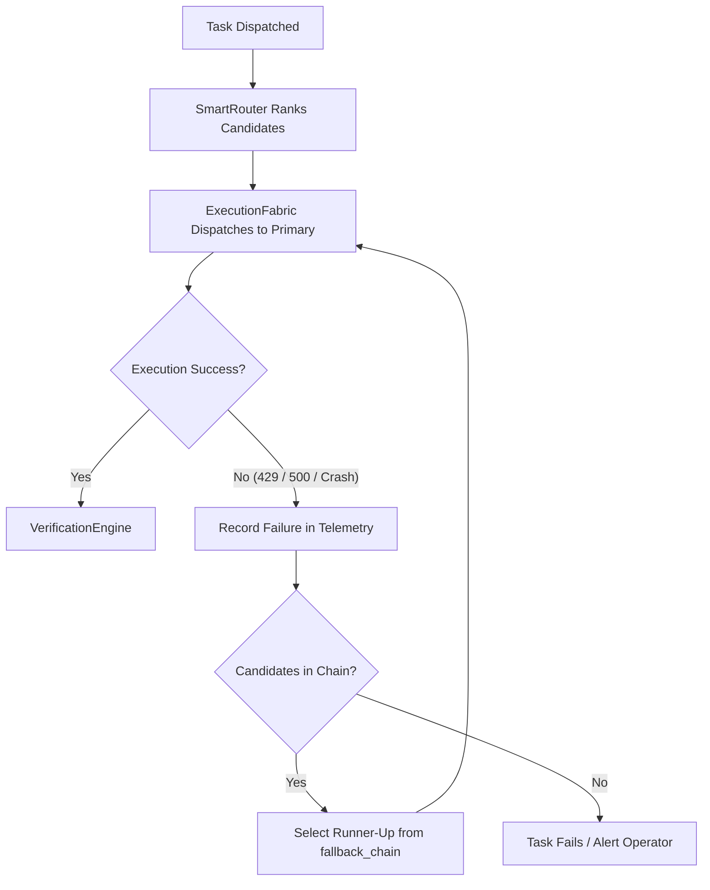
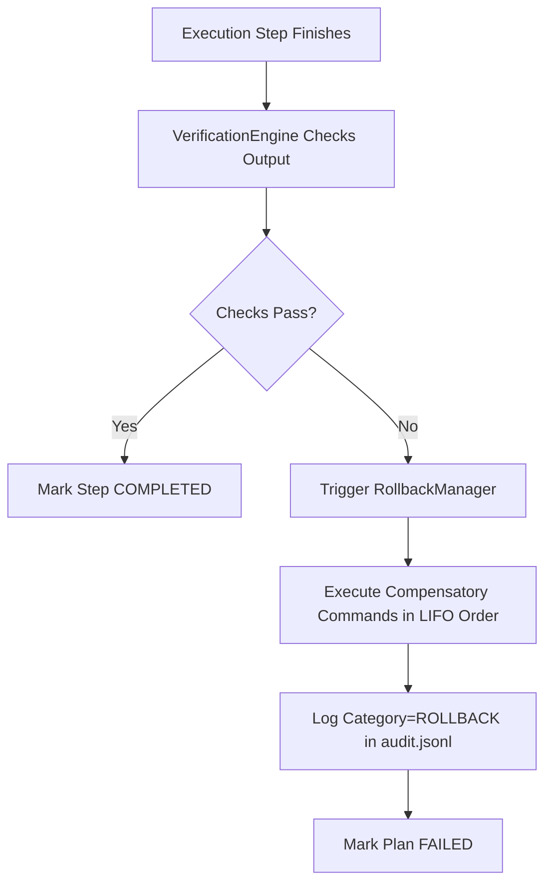

# Failure Modes, Root-Cause Analysis & Recovery Procedures

This guide catalogues all known failure modes in the **Universal AI Mission Control** plane, describing automated mitigations, manual recovery runbooks, and escalation protocols.

---

## 1. Comprehensive Failure Matrix

| Failure Mode | Detection Mechanism | Automated Mitigation | Manual Intervention | Status |
|---|---|---|---|---|
| **Provider API Outage** (HTTP 500/503) | `ProviderRegistry.check_health()` / `ExecutionFabric` | Router triggers failover to next ranked provider in `fallback_chain` | Inspect upstream provider status; disable failing provider | `VERIFIED BY TEST` |
| **Account Quota Exhausted** (HTTP 429) | `QuotaManager` & HTTP status interceptor | Mark account temporarily depleted; rotate to next available account | Provision additional quota; rotate API keys in Key Vault / keyring | `VERIFIED BY TEST` |
| **Headless Agent Crash / Timeout** | `ExecutionFabric` subprocess monitor (timeout / exit code != 0) | Process marked failed; verification invariant fails; rollback invoked | Inspect agent stdout logs in `runtime/sandboxes/` | `VERIFIED BY TEST` |
| **Destructive Command Detected** | `TaskDecomposer` regex guard | Execution unconditionally frozen to `BLOCKED_ON_APPROVAL` | Operator must review and explicitly call `approve_plan()` | `VERIFIED BY TEST` |
| **Invariant Verification Failure** | `VerificationEngine.verify()` | Output rejected; status set to `FAILED`; triggers `RollbackManager` | Check command outputs, fix preconditions, re-run plan | `VERIFIED BY TEST` |
| **Missing MCP Binary / Executable** | `MCPDiscoveryEngine` / `shutil.which` | Server health marked `UNKNOWN`; excluded from dynamic tool catalog | Install missing system package (`npx`, `uv`, `python3`) | `VERIFIED BY TEST` |
| **Local Daemon Offline** (e.g. Ollama) | TCP socket probe (`localhost:11434`) | Adapter marked `UNAVAILABLE`; scored lowest in routing competition | Start daemon via `ollama serve` or systemd service | `VERIFIED LIVE` |
| **GUI Session Collision Risk** | `ExecutionFabric` & `test_gui_safety.py` | Headless execution blocked from sharing default `--app_data_dir` | Ensure all scripts use dedicated `--app_data_dir` | `VERIFIED LIVE` |
| **Stale Git Worktree** | `WorktreeManager` registry lock | Worktrees automatically scoped to unique UUIDs | Run `git worktree prune` if host crashed during execution | `VERIFIED BY TEST` |
| **Credential Leak Attempt** | `SecretRedactor` filter in `AuditLogger` | Regex replaces secrets with `***REDACTED***` before disk write | Audit logs for unauthorized token injection attempts | `VERIFIED BY TEST` |

---

## 2. Automated Recovery Workflows

### 2.1 Multi-Account & Provider Failover Flow


### 2.2 Invariant Verification & LIFO Rollback Flow


---

## 3. Manual Recovery Runbooks

### 3.1 Resolving Provider Quota Depletion
If all accounts for a provider (e.g. `antigravity-api` or `openai`) are exhausted:
1. Temporarily disable the exhausted accounts:
   ```bash
   python3 -c "
   from providers.registry.account_registry import get_account_registry
   reg = get_account_registry()
   reg.disable_account('account-id')
   "
   ```
2. The router will automatically route future tasks to healthy providers (`kiro`, `cline`, or alternate accounts).
3. Once quota is restored, re-enable the account:
   ```bash
   python3 -c "
   from providers.registry.account_registry import get_account_registry
   reg = get_account_registry()
   reg.enable_account('account-id')
   "
   ```

### 3.2 Resolving an Unhandled Destructive Gate
When a plan is blocked waiting for approval:
1. Inspect the blocked plan details:
   ```bash
   python3 -c "
   from brain.mission_brain import MissionBrain
   brain = MissionBrain()
   for p in brain.list_plans():
       if p.status.value == 'BLOCKED_ON_APPROVAL':
           print(f'Plan {p.plan_id}: {p.task}')
           for s in p.steps:
               print(f'  - Step {s.step_id}: {s.title} (Risk: {s.risk_level})')
   "
   ```
2. If safe, execute explicit approval:
   ```bash
   python3 -c "
   from brain.mission_brain import MissionBrain
   brain = MissionBrain()
   brain.approve_plan('plan-id-here', approver='operator-id')
   brain.execute_plan('plan-id-here')
   "
   ```
3. If unsafe, cancel the plan:
   ```bash
   python3 -c "
   from brain.mission_brain import MissionBrain
   brain = MissionBrain()
   plan = brain.get_plan('plan-id-here')
   plan.status = 'CANCELLED'
   brain.planner.save_plan(plan)
   "
   ```

### 3.3 Recovering from a Compromised or Dirty Sandbox
If a headless execution leaves files in an inconsistent state:
1. Remove stale branch and worktree:
   ```bash
   git branch -D brain/swarm/<task-id>
   git worktree prune
   ```
2. Remove temporary sandbox directory:
   ```bash
   rm -rf runtime/sandboxes/agentic-task-<task-id>
   ```

---

## 4. Incident Escalation Protocol

1. **Severity 1 (GUI Disruption / Process Crash)**:
   - Immediate action: Verify active GUI process (`ps -fp 5854`).
   - If disturbed: Relaunch Antigravity IDE from system application launcher; investigate `runtime/audit/audit.jsonl` for rogue process commands.
2. **Severity 2 (Credential Access Violation)**:
   - Immediate action: Inspect `runtime/audit/audit.jsonl` filtered by category `SECURITY`.
   - Invalidate exposed token immediately at cloud provider dashboard.
3. **Severity 3 (Total Provider Outage)**:
   - Verify network egress and firewall settings.
   - Route tasks to local models or offline inspection agents.
