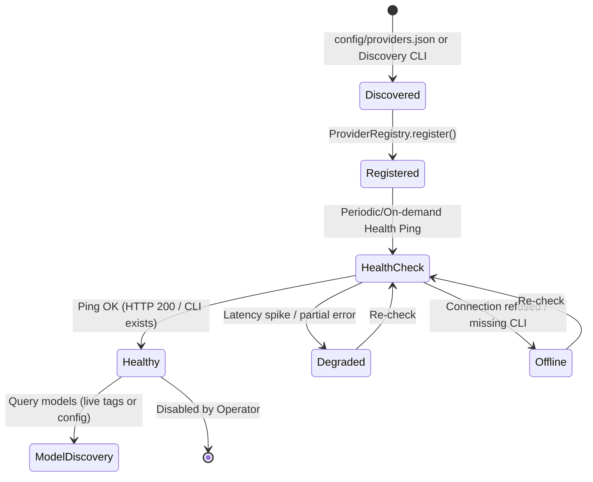
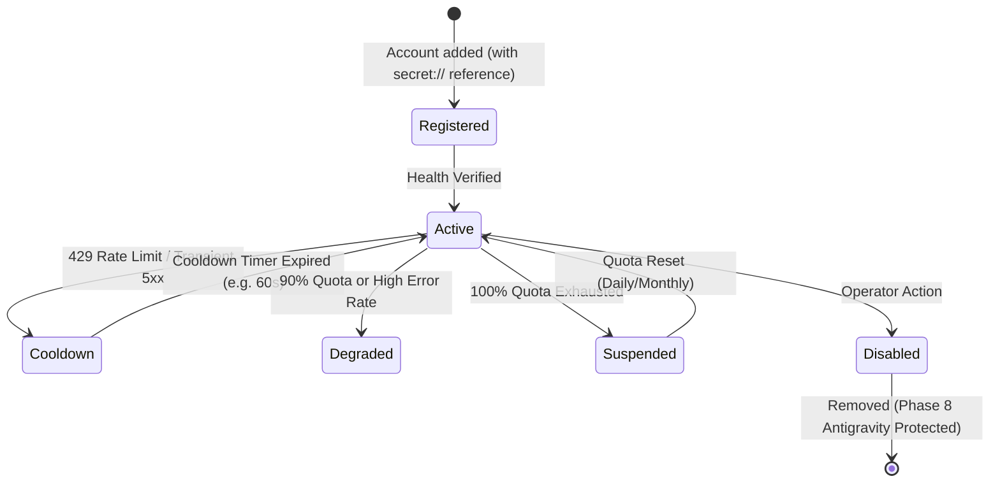
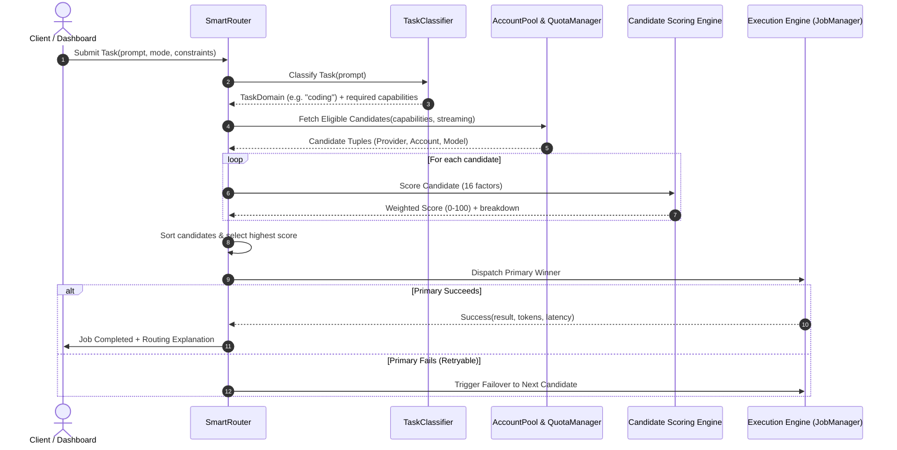
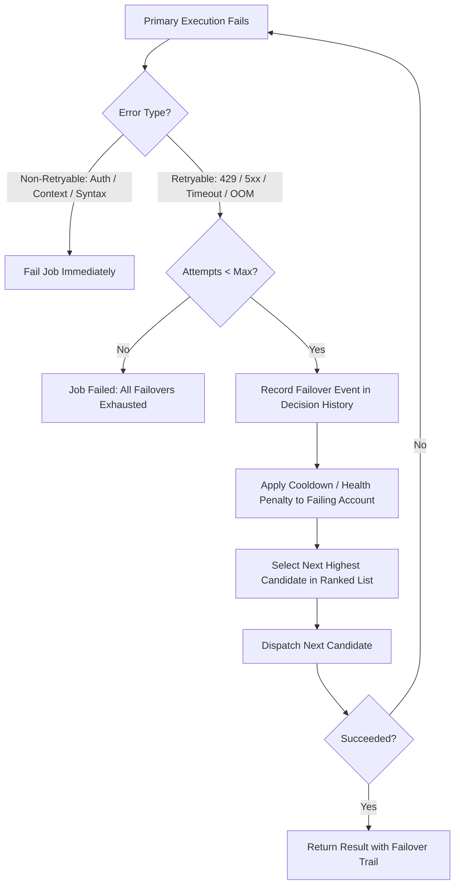

# Routing Architecture & Orchestration Lifecycle

## 1. Executive Summary

The Universal AI Mission Control Routing Engine provides deterministic, multi-factor dispatching across heterogeneous AI runtimes (Antigravity workers, Cline coding agent, Kiro CLI, OpenAI/Anthropic/Gemini APIs, and local Ollama models).

---

## 2. Core Architecture & Lifecycles

### 2.1 Provider Lifecycle

### 2.2 Account Lifecycle

### 2.3 Routing Lifecycle

### 2.4 Failover Lifecycle

---

## 3. Scoring Formula & Factor Weights

For any candidate $C = (P, A, M)$, the aggregate score $S(C)$ is:

$$S(C) = 100 \times \sum_{i=1}^{16} w_i \cdot F_i(C)$$

Where:
- $\sum_{i=1}^{16} w_i = 1.0$ (normalized mode weights)
- Each $F_i(C) \in [0.0, 1.0]$

### Weight Distributions by Mode

| Factor $F_i$ | Balanced | Performance | Cost | Reliability |
| :--- | :---: | :---: | :---: | :---: |
| `capability_match` | 0.25 | 0.30 | 0.15 | 0.15 |
| `provider_health` | 0.10 | 0.05 | 0.05 | 0.20 |
| `account_health` | 0.10 | 0.05 | 0.05 | 0.20 |
| `model_health` | 0.05 | 0.05 | 0.05 | 0.10 |
| `latency` | 0.10 | 0.20 | 0.05 | 0.05 |
| `recent_success_rate` | 0.05 | 0.05 | 0.05 | 0.10 |
| `failure_rate` | 0.05 | 0.05 | 0.05 | 0.10 |
| `account_priority` | 0.05 | 0.05 | 0.05 | 0.02 |
| `provider_priority` | 0.05 | 0.05 | 0.05 | 0.02 |
| `model_priority` | 0.05 | 0.05 | 0.05 | 0.02 |
| `quota_remaining` | 0.05 | 0.02 | 0.15 | 0.02 |
| `estimated_cost` | 0.05 | 0.01 | 0.25 | 0.01 |
| `task_complexity` | 0.02 | 0.04 | 0.01 | 0.01 |
| `context_size` | 0.01 | 0.01 | 0.01 | 0.00 |
| `streaming_support` | 0.01 | 0.01 | 0.01 | 0.00 |
| `tool_support` | 0.01 | 0.01 | 0.01 | 0.00 |
