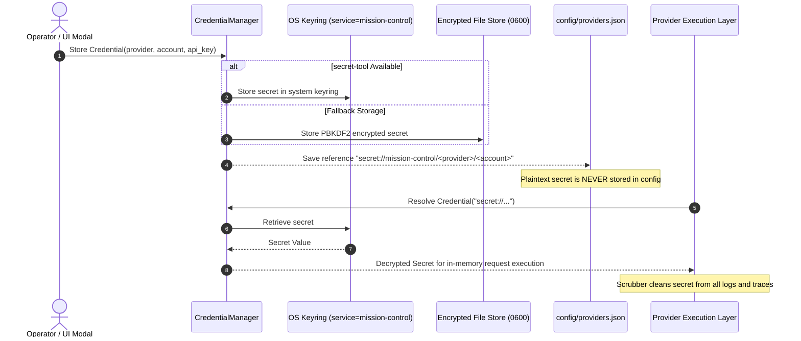
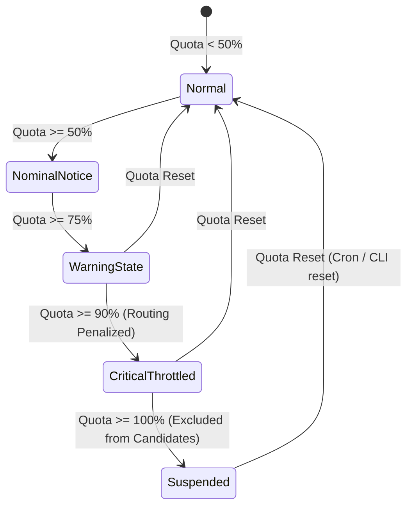
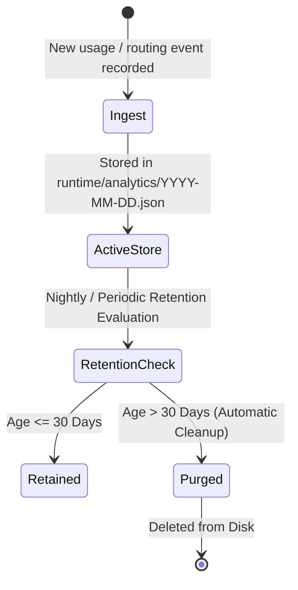

# Usage, Cost, Quotas & Security Lifecycles

## 1. Executive Summary

Universal AI Mission Control enforces strict multi-dimensional usage tracking, cost accounting, quota governance, and OS-level credential protection across all agentic and API workloads.

---

## 2. Core Architecture & Lifecycles

### 2.1 Credential Lifecycle



### 2.2 Usage Lifecycle

```mermaid
flowchart TD
    Complete[Job Completes] --> Parse[Extract Token Usage & Latency]
    Parse --> RecordEvent[UsageTracker.record_event()]
    RecordEvent --> UpdateRolling[Update Daily & Monthly Aggregates]
    UpdateRolling --> ProviderDim[Increment Provider Usage]
    UpdateRolling --> AccountDim[Increment Account Usage]
    UpdateRolling --> ModelDim[Increment Model Usage]
    UpdateRolling --> CostCalc[CostTracker: Calculate USD Cost]
    CostCalc --> QuotaEval[QuotaManager: Evaluate Quota Thresholds]
    QuotaEval --> Persist[Persist Event to Partitioned Storage]
```

### 2.3 Quota Lifecycle



### 2.4 Data Storage & Retention Lifecycle



---

## 3. Data Integrity & Redaction Policy

1. **Strict Key Masking**: Any API endpoint or CLI command querying account information exposes at most the last 4 characters of an API key (e.g. `************abcd`).
2. **Deterministic Pricing**: If pricing per 1M tokens is not verified, it is marked as `unknown`, preventing false budget accounting.
3. **Loopback Isolation**: Web dashboard and API run strictly on loopback interface with mandatory bearer authentication.
